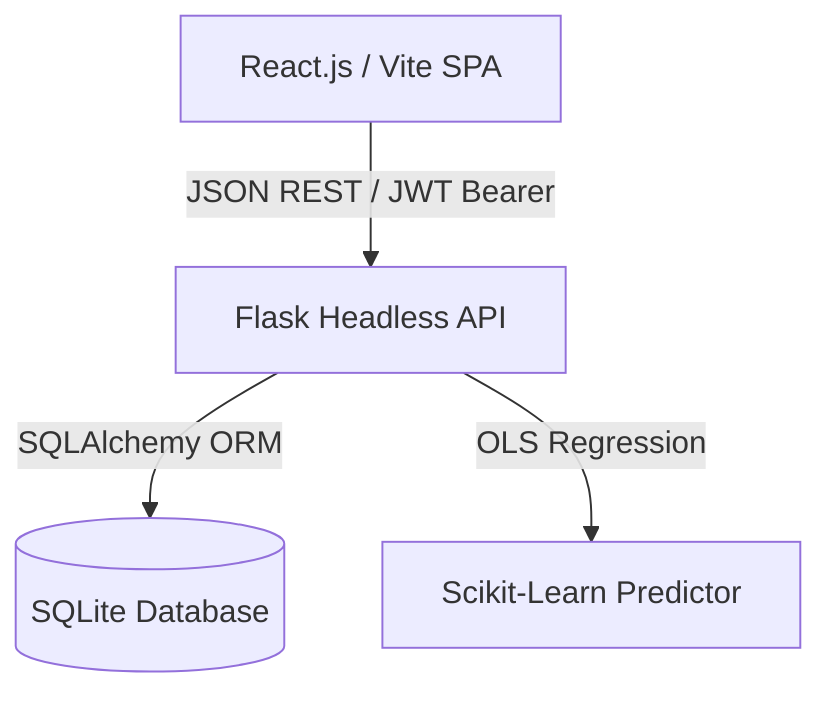

# AETHERSTREAM BI Platform 🚀

AETHERSTREAM is a high-performance, enterprise-grade Business Intelligence (BI) and Predictive Analytics Platform. Designed as a fully decoupled, stateless, and premium single-page application (SPA), it features a stateless Flask REST API backend, a modern React.js frontend, and a built-in predictive estimation pipeline using machine learning.

---

## 🏗️ Technical System Architecture



### ⚡ Headless Backend API (Flask / Python 3.14+)
- **Stateless Authentication:** Implements JWT-based session security utilizing custom bearer tokens.
- **Relational Integrity:** Implements SQLAlchemy ORM with rigorous schema design (`User` & `Transaction` models mapped with cascade controls).
- **Relational Seeding Engine:** Secure `/api/system/seed` database bootstrap endpoint generating 45 transaction entries spanning categories: Software, Hardware, Consulting, and Support.
- **Predictive Analytics Pipeline:** Built-in Ordinary Least Squares (OLS) linear regression model fitting transactional history to calculate next-month revenue trend estimates.
- **Role-Based Access Control (RBAC):** Strict operational authority tiers (**Viewer**, **Manager**, **Admin**).

### 🎨 Glassmorphic Single-Page Application (React.js / Vite)
- **High-Fidelity UI/UX:** Styled using modern Tailwind CSS with fluid transitions, custom hover calculations, and a sleek dark-mode glassmorphic theme.
- **Interactive Datasets visualization:** Custom responsive SVG Area Trend charts and Category Share Donut charts with coordinate-based interactive tooltip calculations (avoiding heavy external libraries).
- **Advanced Management Portal:** Built-in transaction creation drawer, log filters, advanced analytics panels, and administrative deletion workflows.

---

## 🛠️ Tech Stack

* **Frontend:** React.js, Vite, Tailwind CSS, Lucide Icons
* **Backend:** Python 3.14+, Flask, Flask-SQLAlchemy, Flask-CORS, PyJWT
* **Machine Learning:** Scikit-Learn, Pandas, NumPy
* **Database:** SQLite (SQLAlchemy ORM layer)

---

## 🚀 Getting Started

### 1. Prerequisites
Ensure you have the following installed on your machine:
- **Python 3.14+**
- **Node.js (v18+)**
- **npm**

### 2. Setting Up the Backend
1. Navigate to the `backend/` directory:
   ```bash
   cd backend
   ```
2. Set up a virtual environment and install dependencies:
   ```bash
   python -m venv .venv
   source .venv/bin/activate  # On Windows: .venv\Scripts\activate
   pip install -r requirements.txt
   ```
3. Run the development server:
   ```bash
   python app.py
   ```
   *The Flask backend will serve on: `http://localhost:5000`*

### 3. Setting Up the Frontend
1. Navigate to the `frontend/` directory:
   ```bash
   cd frontend
   ```
2. Install npm dependencies:
   ```bash
   npm install
   ```
3. Run the development server:
   ```bash
   npm run dev
   ```
   *The frontend single-page app will serve on: `http://localhost:5173`*

---

## 📦 Production Deployment
To build the frontend SPA client for optimized production:
```bash
cd frontend
npm run build
```
This generates optimized static files inside the `dist/` directory.

---

## 📝 Credentials
A default Admin credential has been seeded automatically:
* **Username:** `admin`
* **Password:** `admin123`
